# Alpine Faction Graphics System

## Overview

Alpine Faction replaces Red Faction's original Direct3D 8 renderer with a modern Direct3D 11 implementation, providing enhanced graphics capabilities while maintaining compatibility with the original game assets.

## Graphics Pipeline Architecture

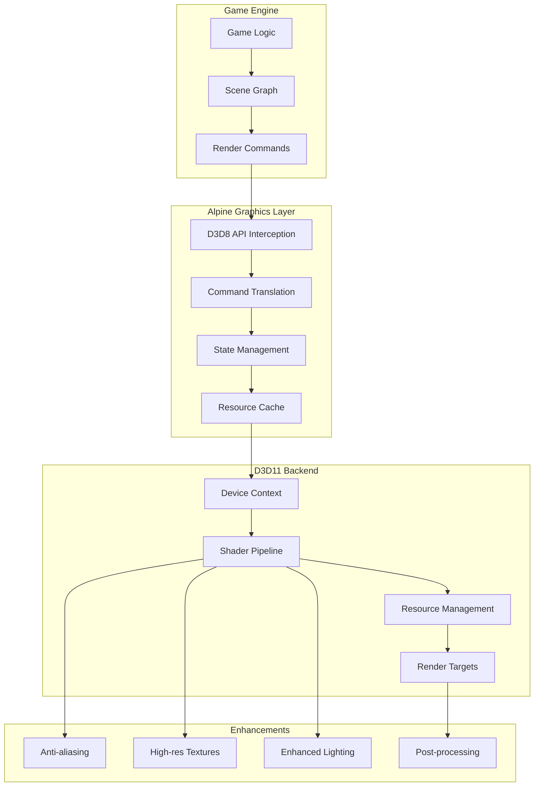

## Shader Pipeline

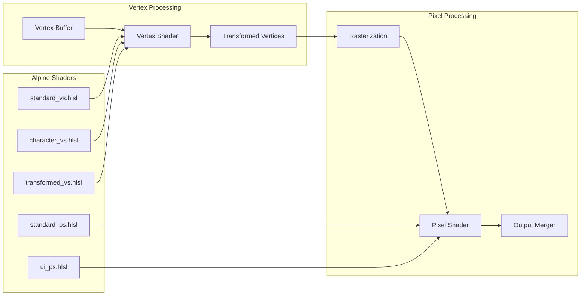

## Texture Management System

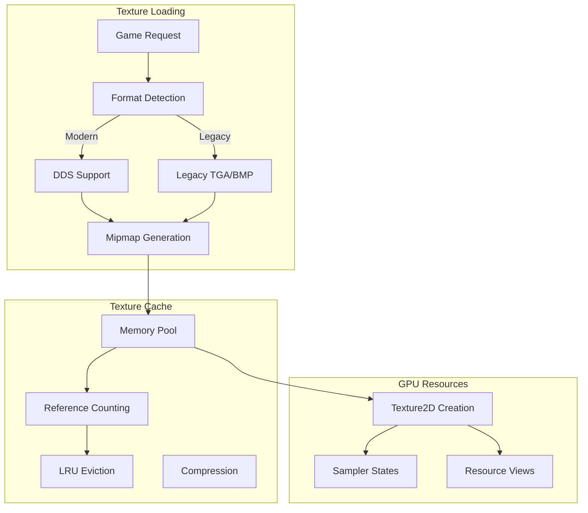

## Lighting System Enhancements

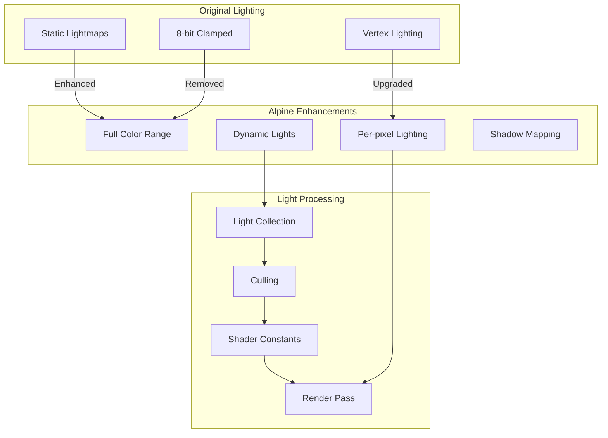

## Render State Management

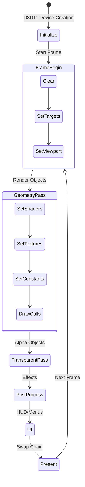

## Anti-Aliasing Implementation

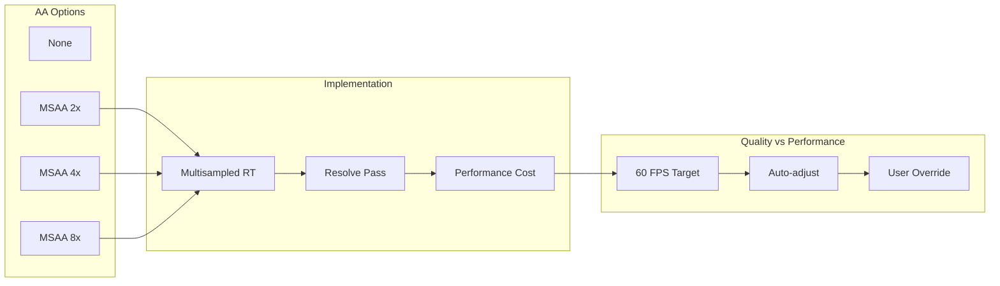

## Resource Creation Flow

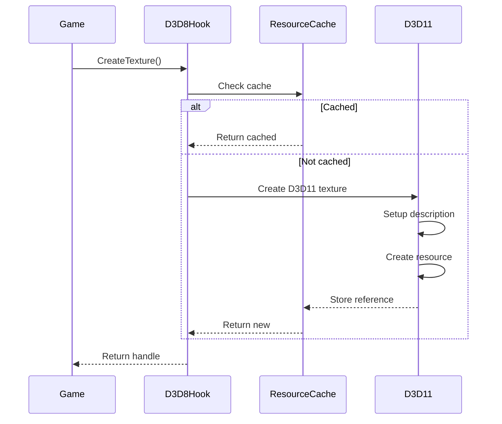

## Dynamic Geometry System

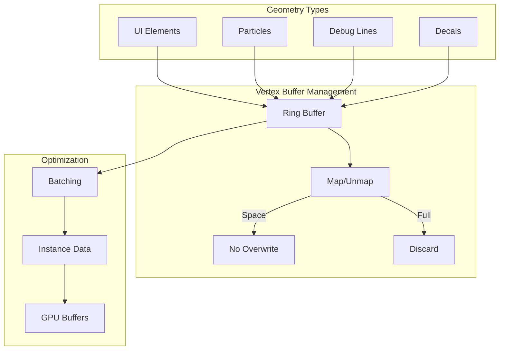

## Post-Processing Pipeline

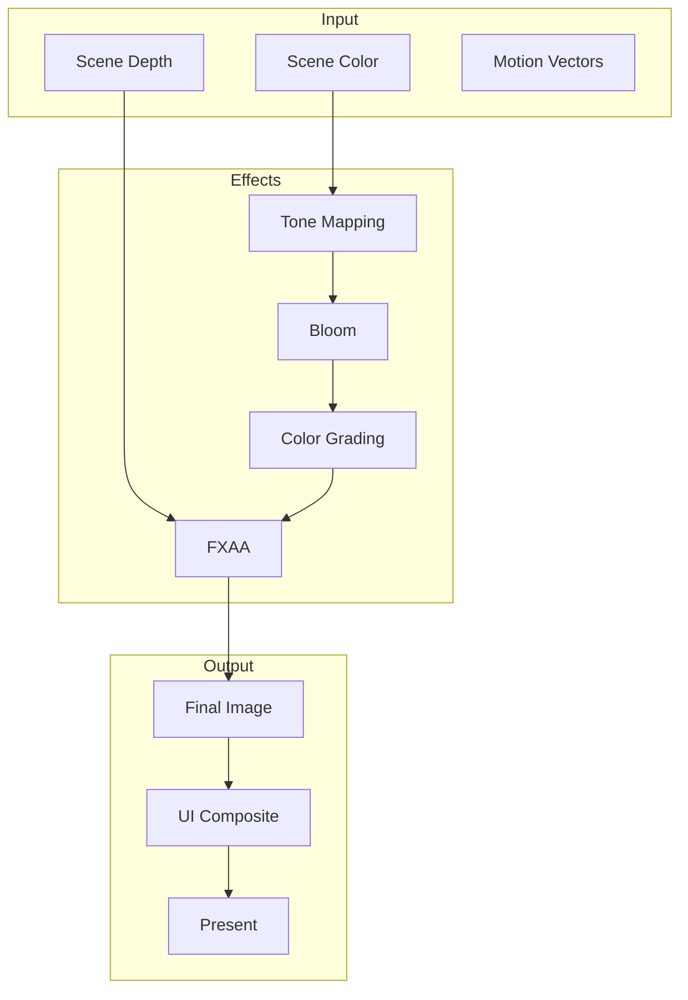

## HUD Rendering System

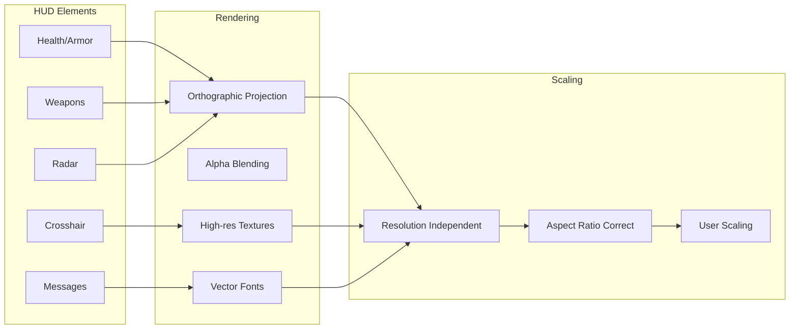

## Performance Monitoring

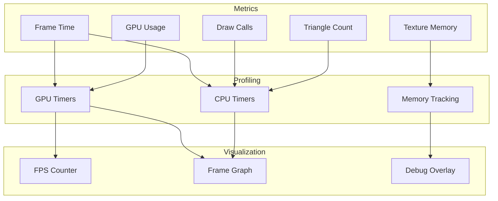

## Compatibility Layer

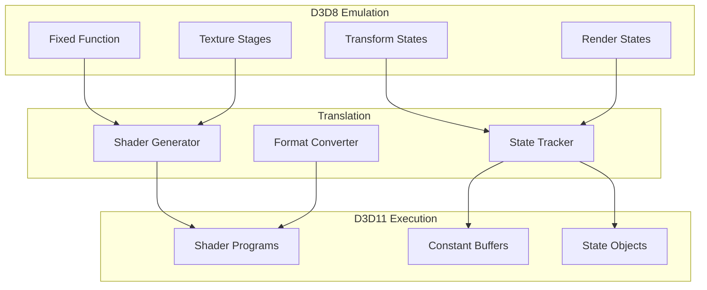

## Mesh Rendering Pipeline

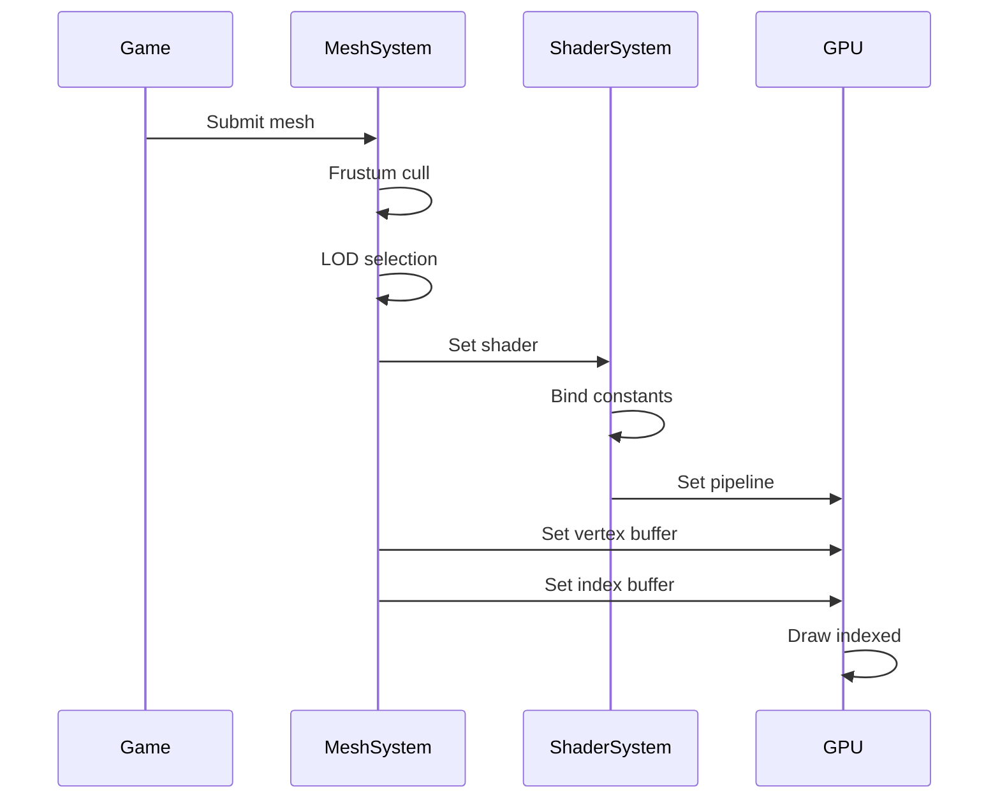

## Enhanced Features

### 1. Full Color Range Lighting
- Removes 8-bit clamping from lightmaps
- Supports HDR lighting calculations
- Better contrast and color accuracy

### 2. High Resolution Support
- Arbitrary resolution support
- Proper aspect ratio handling
- Resolution-independent HUD

### 3. Texture Improvements
- DDS texture support with compression
- Automatic mipmap generation
- Higher resolution texture support

### 4. Shader Effects
- Per-pixel lighting
- Normal mapping support
- Improved transparency handling

### 5. Performance Optimizations
- Reduced draw calls through batching
- Efficient state management
- GPU-based culling

## Configuration Options

```ini
[Graphics]
Resolution = 1920x1080
Fullscreen = false
AntiAliasing = 4
AnisotropicFiltering = 16
TextureFiltering = trilinear
VSync = true
FramerateLimit = 0
Gamma = 1.0
```

## Debug Visualization

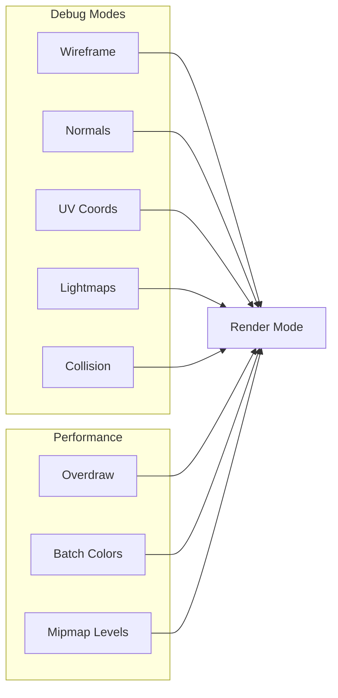