# Alpine Faction Injection and Hooking System

## Overview

Alpine Faction uses sophisticated runtime code modification techniques to enhance Red Faction without access to its source code. This document details the injection framework, hooking mechanisms, and how they integrate to create new functionality.

## System Architecture

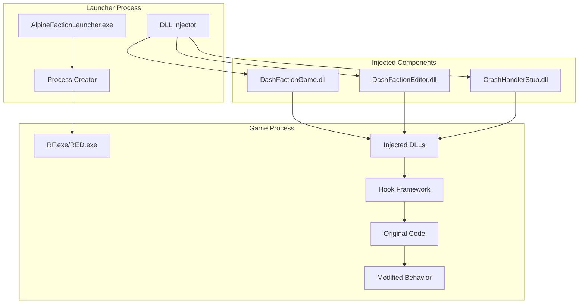

## Injection Process

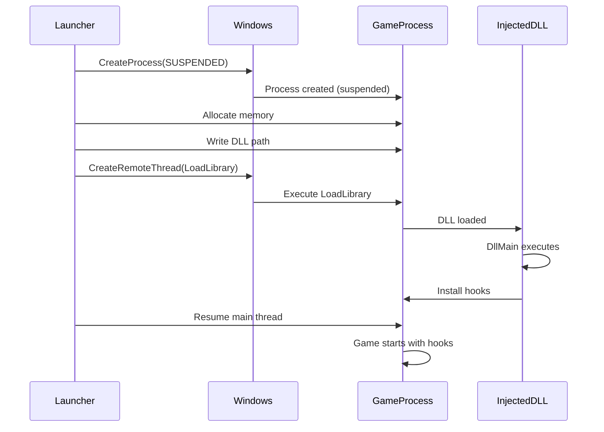

## Hook Types and Implementation

### 1. Function Hooks (FunHook)

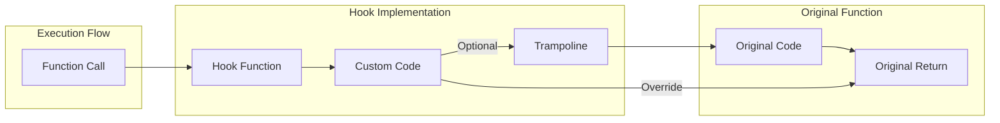

**Example Implementation:**
```cpp
FunHook<void(int, const char*)> log_hook{
    0x00505F70,  // Original function address
    [](int level, const char* msg) {
        // Custom preprocessing
        process_log_message(msg);
        
        // Call original function
        log_hook.call_target(level, msg);
        
        // Custom postprocessing
        send_to_external_logger(msg);
    }
};
```

### 2. Call Hooks (CallHook)

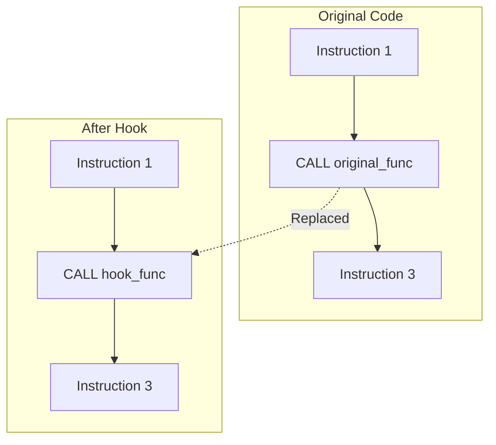

**Example Implementation:**
```cpp
CallHook player_spawn_hook{
    0x0045B7A2,  // Address of CALL instruction
    [](rf::Player* player) {
        original_spawn(player);
        
        // Alpine Faction additions
        apply_spawn_protection(player);
        trigger_spawn_effects(player);
        update_scoreboard(player);
    }
};
```

### 3. Code Injection

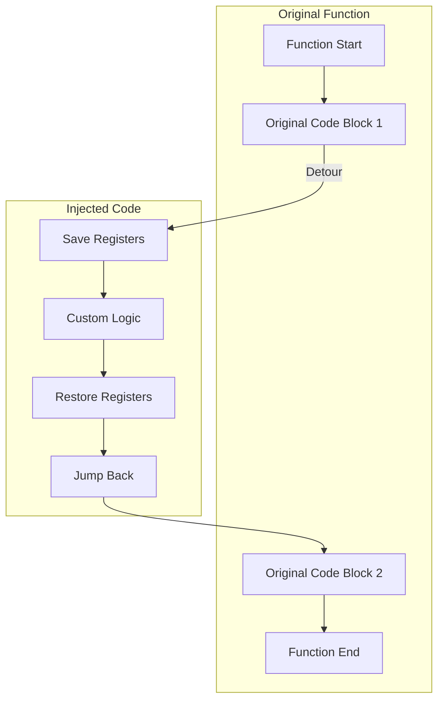

**Example Implementation:**
```cpp
CodeInjection damage_calc_injection{
    0x00418B45,  // Injection point
    [](auto& regs) {
        float damage = regs.eax;
        
        // Apply Alpine Faction damage modifiers
        damage *= get_damage_multiplier();
        
        if (is_critical_hit()) {
            damage *= 2.0f;
            play_critical_sound();
        }
        
        regs.eax = damage;
    }
};
```

## Memory Management

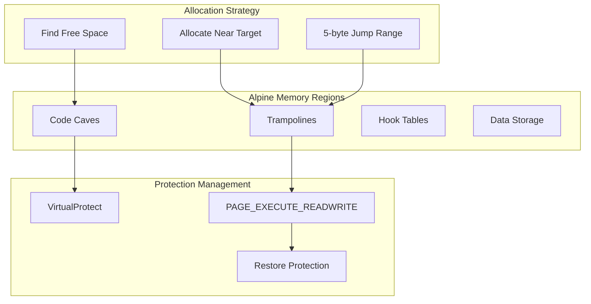

## Virtual Table Patching

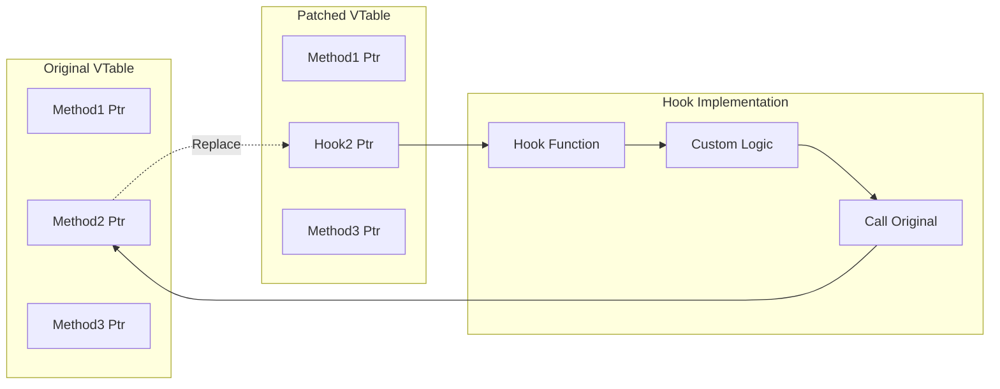

## Hook Installation Process

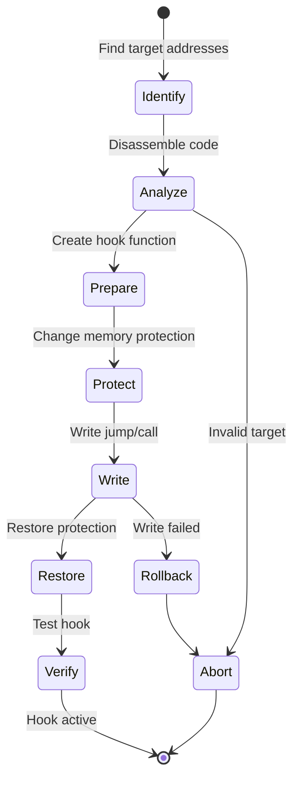

## Common Hook Patterns

### 1. Render Pipeline Hooks

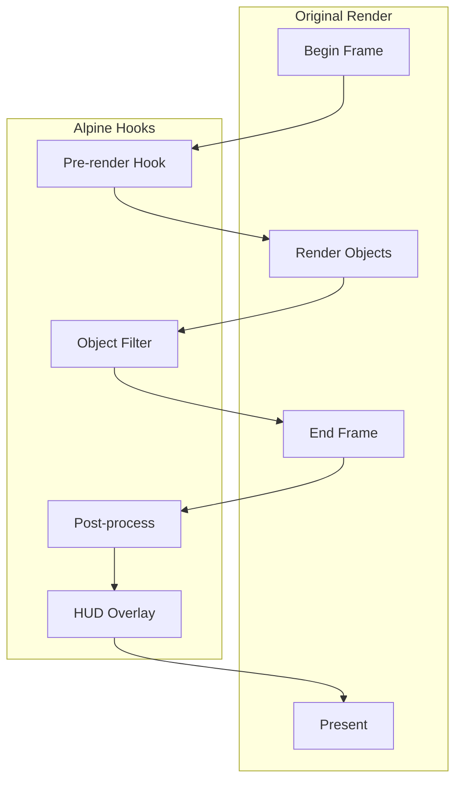

### 2. Input Processing Hooks

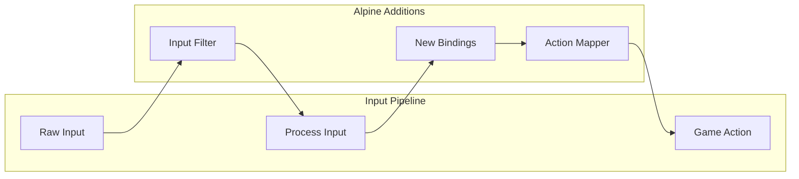

### 3. Network Packet Hooks

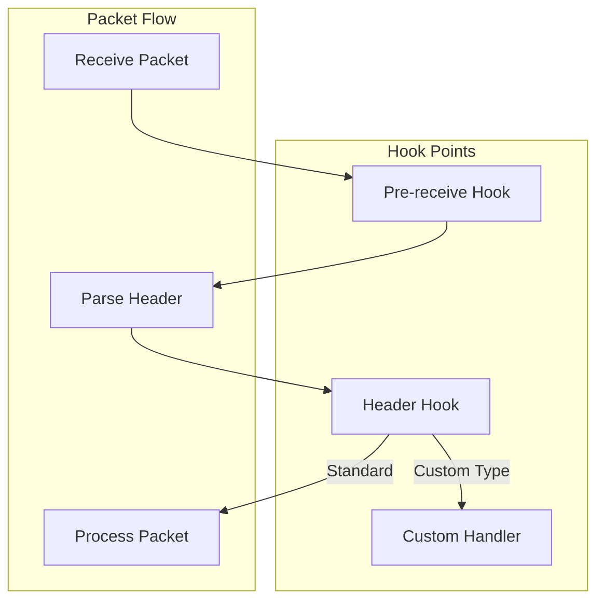

## Advanced Techniques

### 1. Hot Patching

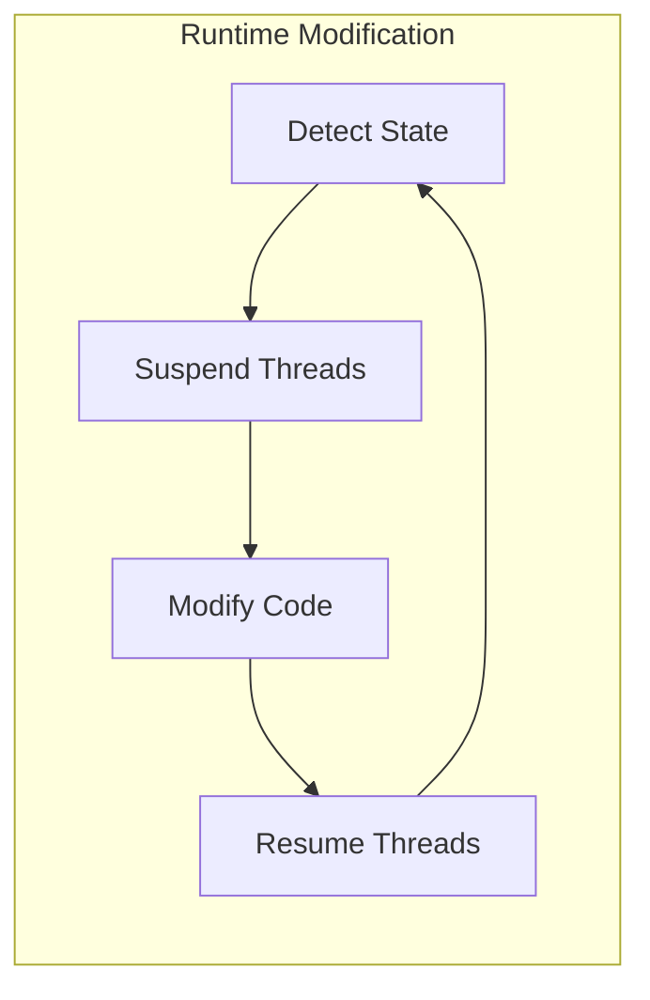

### 2. Detour Chains

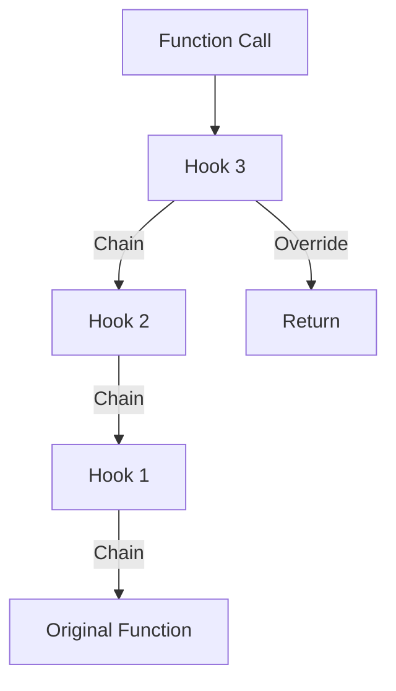

### 3. Safe Hooking

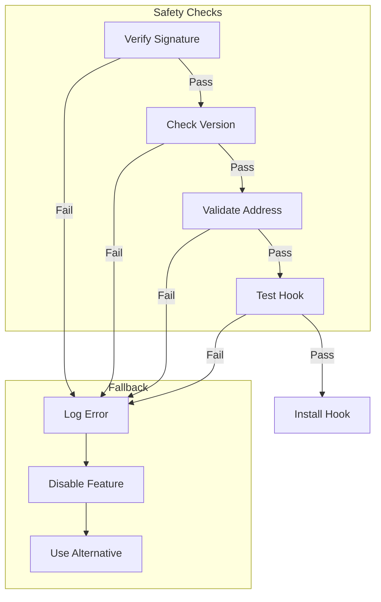

## Performance Considerations

### Hook Overhead

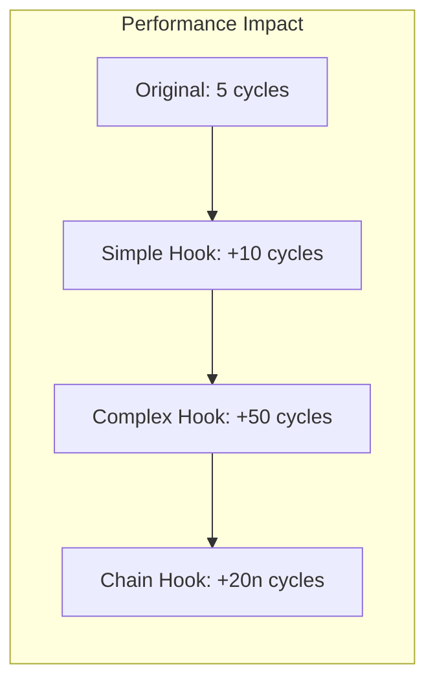

### Optimization Strategies

1. **Inline Assembly** - Minimize register saves
2. **Conditional Hooks** - Only execute when needed
3. **Batch Operations** - Group related modifications
4. **Cache Friendly** - Keep hook code in same page

## Debugging Hooks

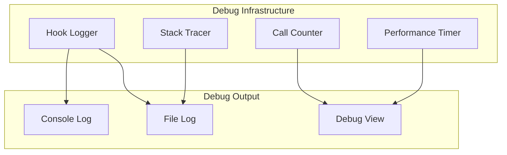

## Security Implications

### Anti-Tamper Detection

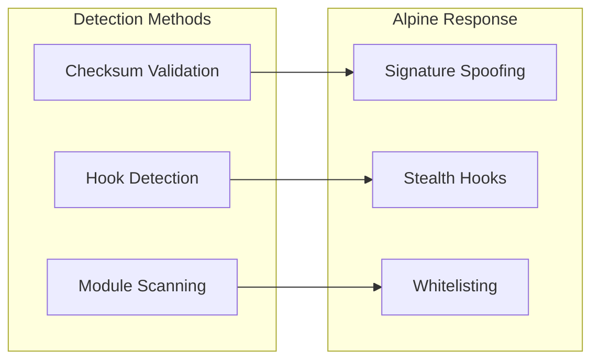

### Protection Mechanisms

1. **Code Integrity** - Verify hook targets before installation
2. **Access Control** - Limit hook installation to initialization
3. **Validation** - Check hook results for sanity
4. **Isolation** - Separate hook code from game memory

## Best Practices

1. **Always Save Registers** - Preserve CPU state
2. **Check Boundaries** - Validate memory access
3. **Handle Failures** - Graceful degradation
4. **Document Hooks** - Clear purpose and dependencies
5. **Version Specific** - Account for game updates
6. **Thread Safety** - Consider concurrent access
7. **Performance Test** - Measure impact
8. **Reversibility** - Support unhooking