# Alpine Faction Network Architecture

## Overview

Alpine Faction extends Red Faction's networking system with custom packets, enhanced security, and modern features while maintaining backward compatibility with the original protocol.

## Network Packet Flow

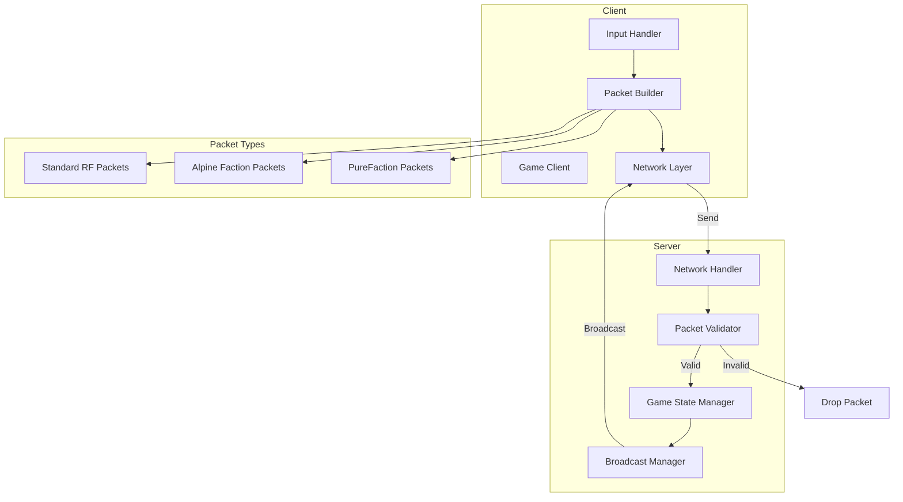

## Custom Packet System

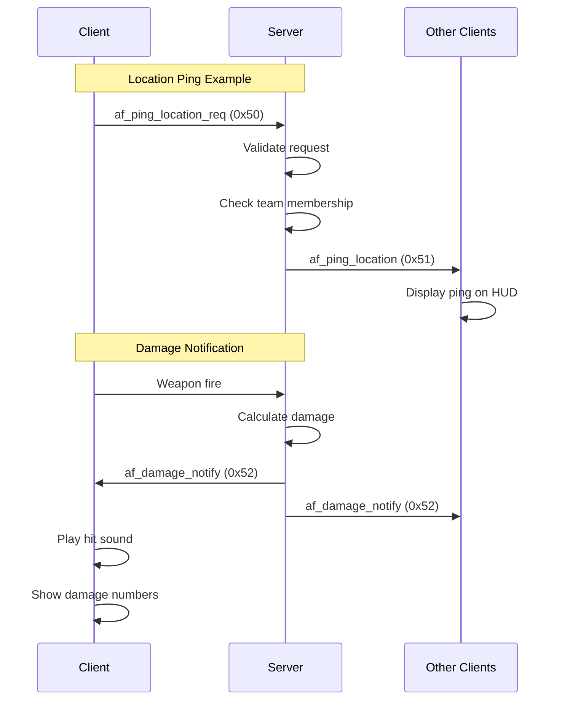

## Packet Type Hierarchy

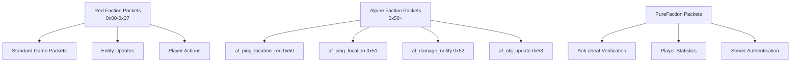

## Injection and Hook System

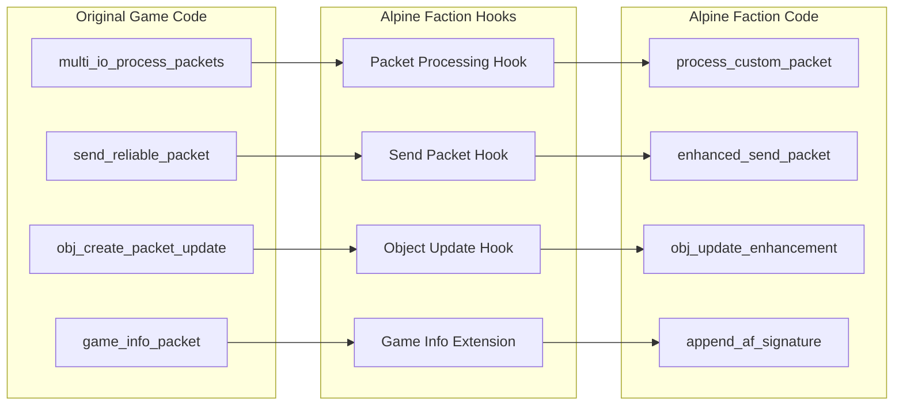

## System Integration Architecture

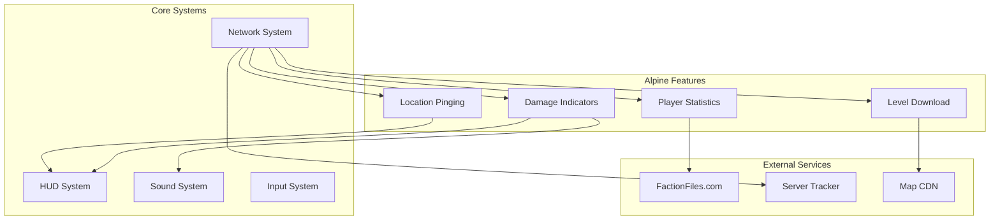

## Game Mode State Machine

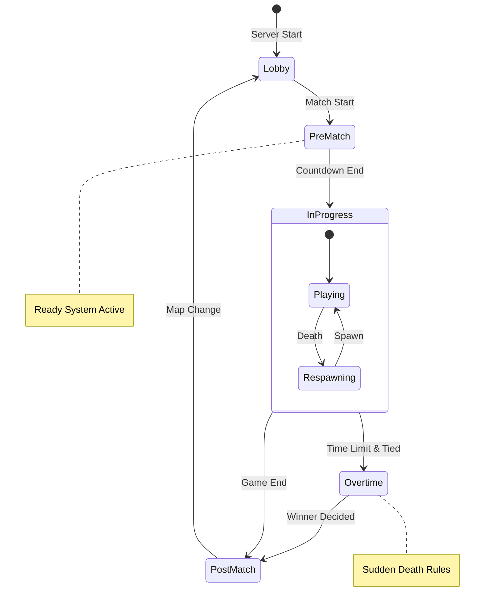

## PureFaction Integration

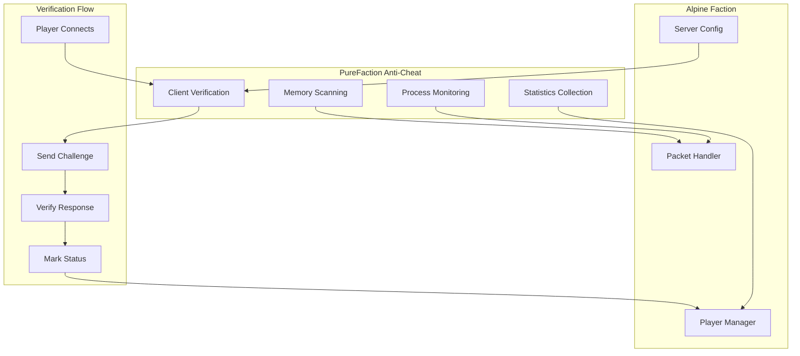

## Server Configuration Flow

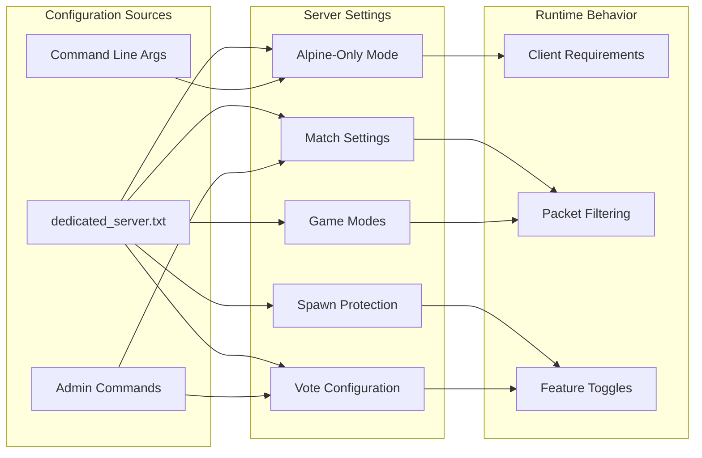

## Damage Notification System

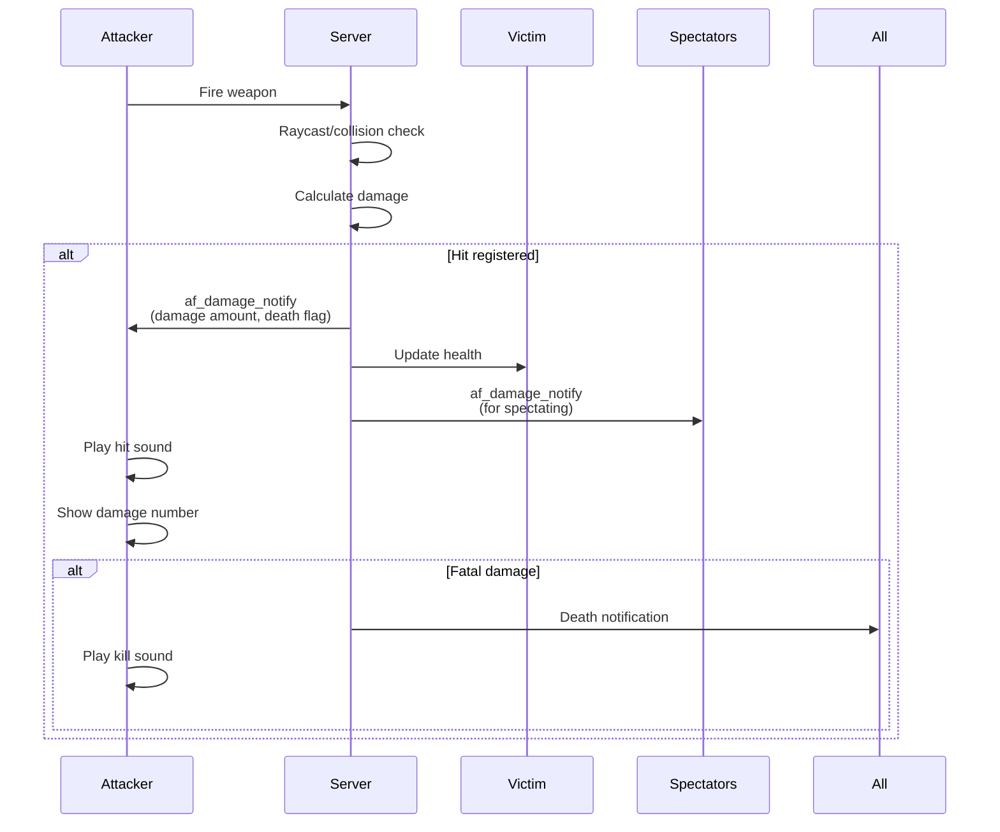

## Level Download System

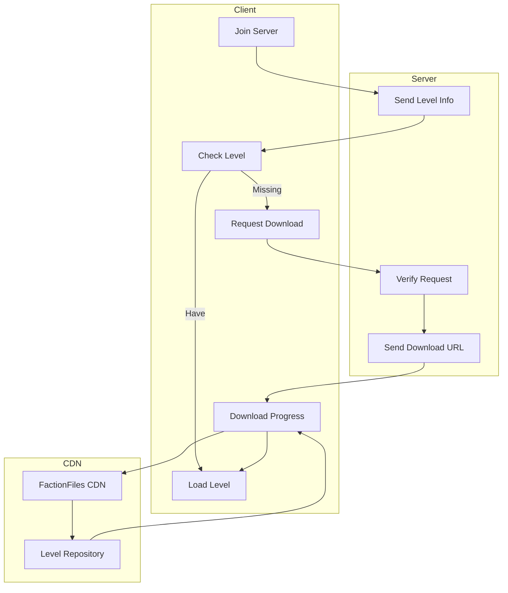

## Enhanced Game Modes

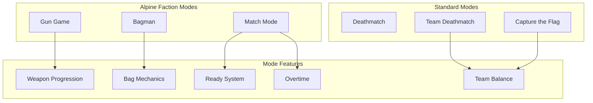

## Packet Security Model

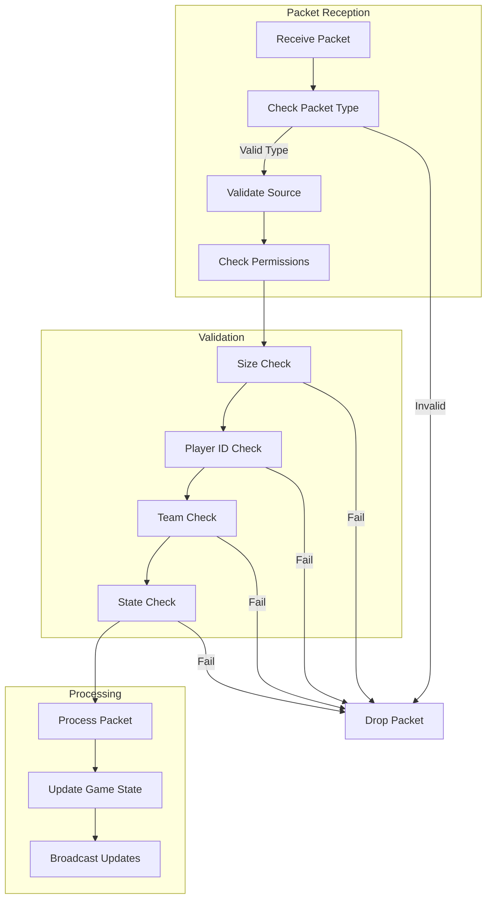

## Implementation Details

### Packet Structure

Alpine Faction packets follow this general structure:

```c++
struct AfPacketHeader {
    uint8_t type;      // Packet type (0x50+)
    uint8_t player_id; // Source player ID
    // Packet-specific data follows
};
```

### Hook Points

Key injection points in the original game:

1. **`multi_io_process_packets`** (0x0047918D) - Main packet processing
2. **`send_reliable_packet`** - Outbound packet interception
3. **`obj_create_packet_update`** - Enhanced object synchronization
4. **`game_info_packet`** - Server information extension

### Security Considerations

- All custom packets are validated for size and content
- Player IDs are verified against connection state
- Team-specific packets check team membership
- Server-only packets rejected from clients
- Buffer overflow protection on all packet reads

### Performance Optimizations

- Dynamic packet sizing based on player count
- Conditional updates only for changed state
- Efficient bit packing for boolean flags
- Batched updates where possible
- Client-side prediction for smooth gameplay